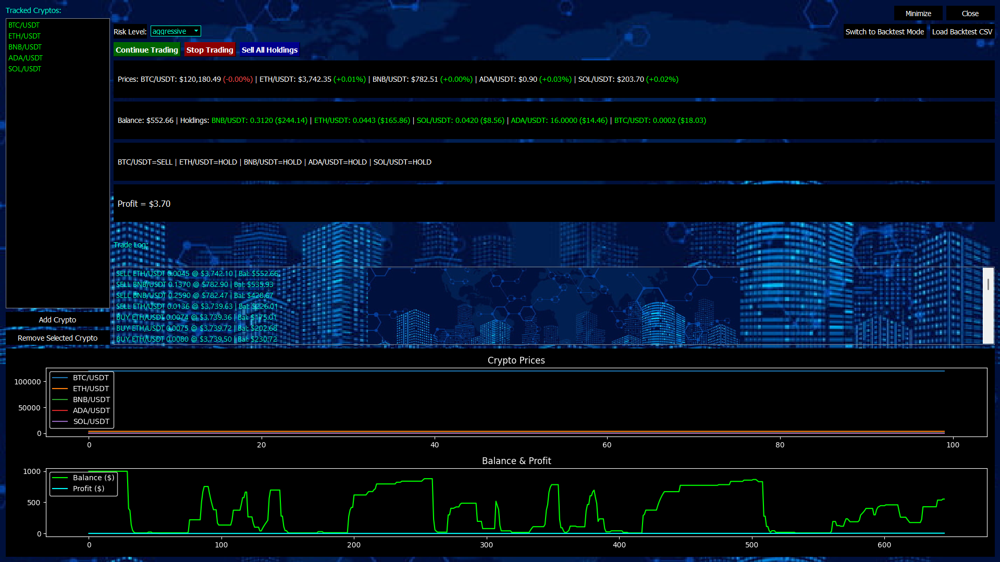

<<<<<<< HEAD
# 💹 AI Crypto Simulator

A sleek, AI-powered trading simulator with real-time crypto data, customizable risk strategies, and a modern PyQt5 interface. Perfect for testing ideas or just playing around with the markets.

---

## 🚀 Features

- 📈 **Live Binance Prices** via `ccxt`
- 🤖 **Basic AI Trading Logic** using RSI + EMA signals
- ⚙️ **Risk Control**: Adjustable AI risk levels
- 🧪 **Backtesting Mode**: Upload your own CSV data
- 💰 **Smart Portfolio Management**: Dynamic position sizing, profit-only selling
- 📊 **Dual Graphs**: Price trends & AI decisions
- 📝 **Trade Logging** and minimal notional enforcement
- 🎮 **Full UI Control**: Start, stop, full sell, and more

---

## 📦 Download

🔽 [**Download for Windows (.exe)**](https://github.com/Nedas-Miliunas/AI_Trading/releases/tag/v1.0.0)

No installation hassle — run it straight from the installer.

---

## 🧠 AI Trading Strategy

The AI uses a simple but effective combo of:

- **RSI (Relative Strength Index)** for identifying overbought/oversold conditions  
- **EMA (Exponential Moving Average)** for short/long-term trend detection  
- **Volatility-Aware Positioning**: Buys more when markets are calm, less when volatile  
- **Profit-Only Selling**: AI sells only when the trade is in the green ✅

This isn’t a get-rich-quick bot — it's a realistic simulator meant for learning and experimenting.

---

## 🖼️ Interface Preview

---

## 🛠️ Tech Stack

- 🐍 Python 3.11+
- 🖼️ PyQt5 for the graphical interface
- 📊 matplotlib for data visualization
- 🌐 ccxt for exchange integration
- 🛠️ Inno Setup for building the Windows installer
=======
# 💹 AI Crypto Simulator

AI-powered live and backtest trading simulator with PyQt5 GUI, real-time Binance data, and simple ML heuristics.

## 🚀 Features
- Live data from Binance via `ccxt`
- Real-time balance & crypto chart
- Adjustable AI risk levels
- Backtest mode with CSV upload
- Logging, quantization, and minimal notional rules

## 📦 Download
[👉 Windows Installer (.exe)](link.com)

## 🧠 AI Strategy
Uses simplified RSI + EMA signals with dynamic position sizing based on volatility.

## 🖼️ Preview

## 🔧 Tech Stack
- Python, PyQt5, matplotlib
- ccxt for exchange data
- Inno Setup for installer
>>>>>>> d91f1b6 (Fix: Treat PNGs as binary for GitHub rendering)
